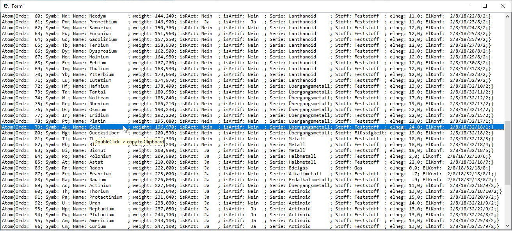

# Chem_PeriodicTab  
## creates chemic periodic table (elements should be calculated from ord number)  
project started in summer 2018 is not finished, didn't manage it due to lack of chemical knowledge.  
Goals is the periodic table should create itself, every atom should be created just by ord-number.  
Creation of orbitals should come from outside of atom class, maybe fabric-pattern could help.  
. . . work in progress   

